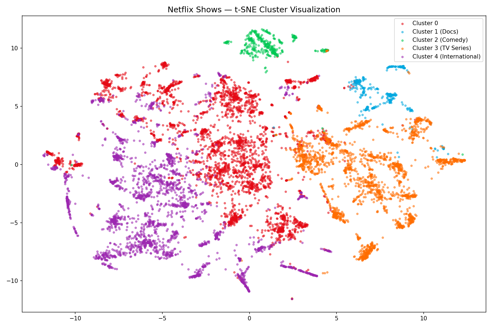

# Netflix Show Clustering & Recommender

An unsupervised ML project that clusters Netflix shows by content 
and recommends similar titles using TF-IDF and KMeans clustering.

## What it does
- Clusters 8800+ Netflix titles into 5 content groups
- Recommends similar shows using cosine similarity
- Interactive web app built with Streamlit

## Clusters discovered
| Cluster | Type |
|---------|------|
| 0 | General Movies |
| 1 | Documentaries |
| 2 | Stand-up Comedy |
| 3 | TV Series/Dramas |
| 4 | International Content |

## Tech Stack
Python, Pandas, Scikit-learn, TF-IDF, KMeans, t-SNE, Streamlit

## Project Structure
- `eda.py` — Exploratory Data Analysis
- `preprocessing.py` — Data cleaning and feature engineering
- `clustering.py` — TF-IDF vectorization and KMeans clustering
- `visualization.py` — t-SNE cluster visualization
- `app.py` — Streamlit recommender web app

## How to run
```bash
pip install -r requirements.txt
streamlit run app.py
```

## Results
